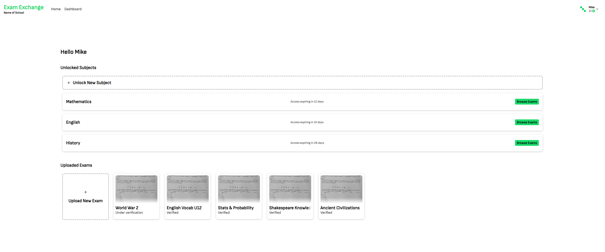

# Exam Exchange
An exam exchange website made for self-hosting and Built with NextJS and Supabase. Upload exams and benefit from other exams. No more advantages for those with older siblings. A solid system that ensures that you also have to upload your own exams. Customizable for any school.

## [Setup](SETUP.md)

## Screenshots
 
**Home page**

 
**Dashboard page**

 
**Upload page that has the ability to edit the exams images directly**

 
**Browse page with pagination, search and filter**

 
**Unlock page with number of exams that are getting unlocked**

 
**Admin validation page**

 
**A lot of visual feedback for the ease of use**